# BradleyRichmond_T2A2
## Aquarium/Fishtank Management API
## Github link: https://github.com/bradx32/BradleyRichmond_T2A2
### Requirements

## R1 Explain the problem that this app will solve, and explain how this app solves or addresses the problem.

#### Maintaining an aquarium or multiple fishtanks in a business or household can involve many tasks such as keeping track of the fish, managing the maintenance of each fishtank and ensuring the ideal water parameters for specific aquatic life. 

#### Whether you are an aquarium enthusiast, hobbyist or professional, keeping track of aquarium details manually can be cumbersome and time consuming. Small to large aquariums can benefit from a system to manage the information, reducing the risk of mismanagement which can lead to unhealthy living conditions, increased maintenance costs and potentially loss of aquatic life. 

#### The application provides a structured and efficient way to manage fishtanks or 'Aquarium' related data. It offers a centralised platform where users can Create, Read, Update and Delete data. The main features of the app are:

#### Fishtank Information tracking:
- Users can create, read, update, and delete fishtank records. Each fishtank record includes details such as the tank's name and its associated fish species.

#### Manage Fish Species:
- The app allows users to maintain a list of fish species within each tank, specifying attributes like species name and quantity. It also ensures that species are not mixed across multiple tanks, preventing cross breading between two similar species, removing the risk of undesired hybrid species.

#### Maintenance Logs:
- Users can keep detailed maintenance logs for each fishtank. These logs help track regular maintenance tasks, ensuring that all necessary care actions are performed timely and properly.

#### User Authentication and Authorization:
- The app includes a robust user authentication system with role-based access control. Admin users have privileges to manage all aspects of the system, including deleting users, which enhances security and ensures that only authorised persons can perform critical actions.

#### Data Validation and Integrity:
- The application enforces data validation rules to ensure the integrity and correctness of the information stored. For instance, it validates that the fish species names are not reused across tanks and that all required fields are correctly filled out.

### How does the app solve the problem?
#### The app provides a centralised system for managing fishtank data, enhancing the accuracy and efficiency by automating data entry and validation. It allows users to log maintenance activities and track fish species, promoting regular upkeep and a healthy aquatic environment. With security measures like user authentication and role based access control, the app ensures data integrity and system security. The API based architecture supports easy integration and scalability, making it suitable for both small and large fishtank/aquarium setups.


## R2 Describe the way tasks are allocated and tracked in your project.

### Trello Link: https://trello.com/b/mEjKnbcw/bradleyrichmondt2a2
- Visibility: Public

#### Trello has been used in the project to allocate and track tasks in the project. See the below screenshots for a snapshot of the progression and tasks planned for completion. The board is setup as a solo project although for a group it would have members assigned to different tasks, working on different branches and then pushing online, pulling to the main branch once approved. 

#### Trello Home
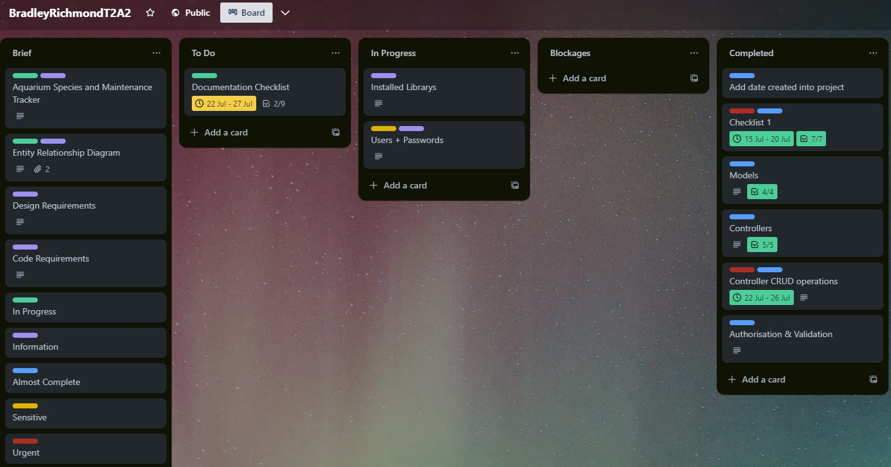
#### Project Brief
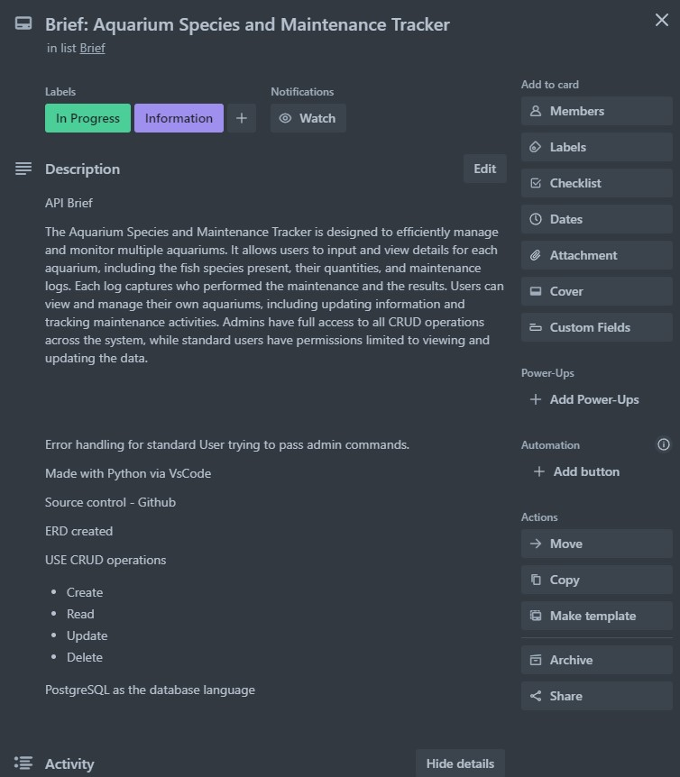
#### Project ERD with 2nd image update as ERD progressed.
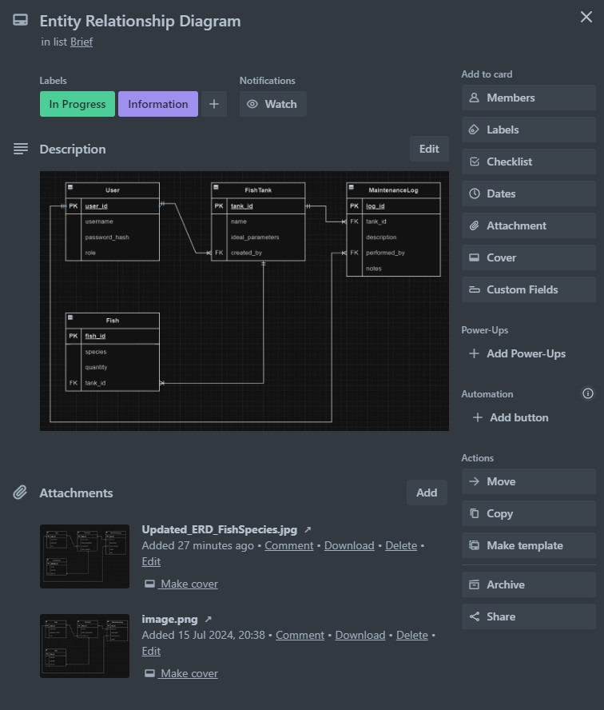
#### Completed Checklist 1
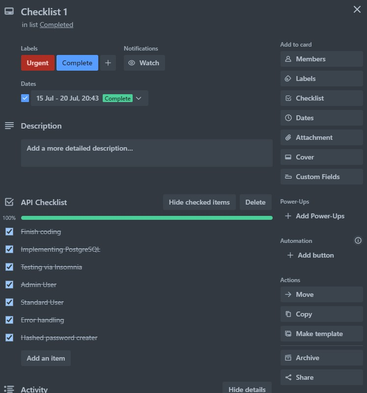
#### Models checklist
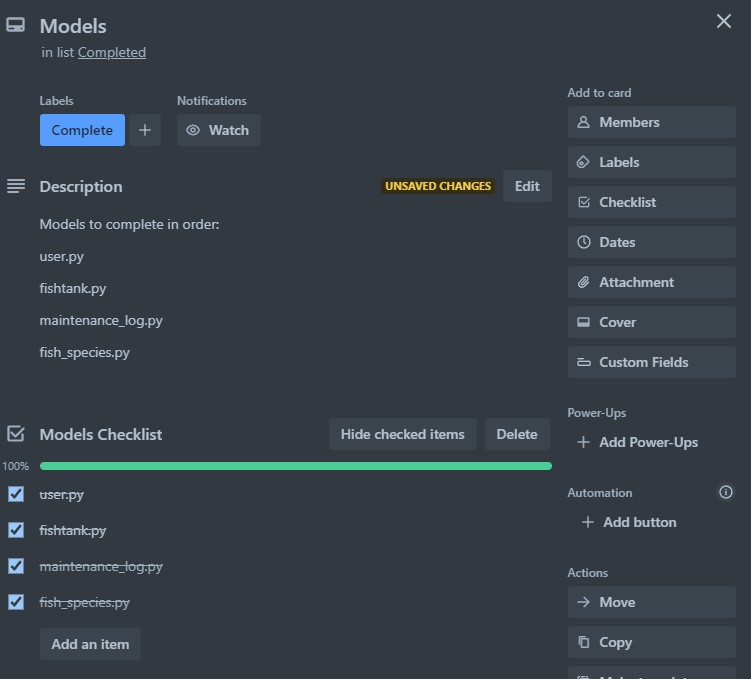
#### Controllers checklist
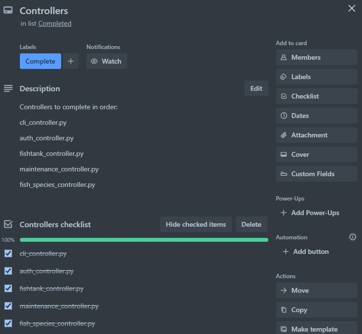
#### Controller CRUD operations
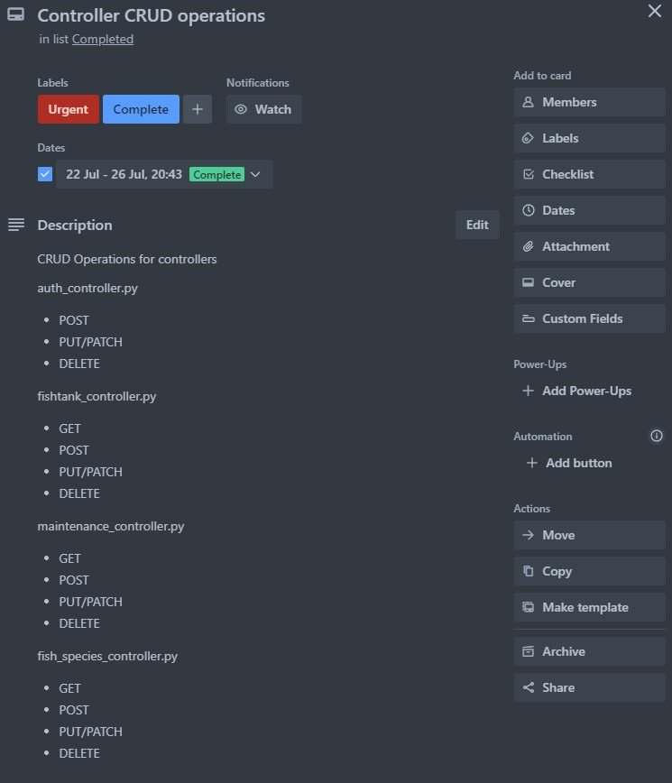
#### Authorisation and Validation
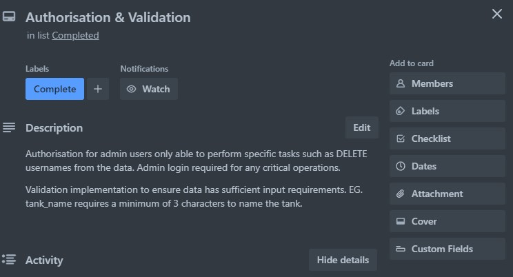


## R3 List and explain the third-party services, packages and dependencies used in this app.

### The third-party services, packages and dependencies used in the application are Flask, SQLAlchemy, Mashmallow, Flask-JWT-Extended, Bcrypt, Psycopg2 and Trello (project management). These services collectively provide the essential functionalities needed to build and maintain the API.

#### Flask: The web application framework used to create the API. It provides the necessary tools and libraries to build the web application, handle the routing and request/response handling.

#### SQLAlchemy: An SQL toolkit and Object-Relational Mapping (ORM) library for Python. It allows for the manipulation of database records using Python objects, making the database interactions easier to manage.

#### Example of the SQLAlchemy used in the project user.py model. 
``` 
class User(db.Model):
    __tablename__ = 'users'
    id = db.Column(db.Integer, primary_key=True)
    username = db.Column(db.String, nullable=False, unique=True)
    password = db.Column(db.String, nullable=False)
    role = db.Column(db.String, nullable=False, default='standard')
    is_admin = db.Column(db.Boolean, default=False) 
```
#### Example of the SQLAlchemy used in the create_fish_species POST endpoint 
``` 
@fish_species_bp.route("/", methods=["POST"])
@jwt_required()
def create_fish_species():
    try:
        body_data = fish_species_schema.load(request.get_json())
        species = FishSpecies(
            species_name=body_data.get("species_name"),
            quantity=body_data.get("quantity"),
            tank_id=body_data.get("tank_id")
        )
        db.session.add(species)
        db.session.commit()
        return fish_species_schema.dump(species), 201
    except IntegrityError as err:
        if err.orig.pgcode == errorcodes.FOREIGN_KEY_VIOLATION:
            return {"error": f"Invalid foreign key value for tank_id: {body_data.get('tank_id')}"}, 409
        else:
            return {"error": "An error occurred while creating the fish species"}, 500
```

#### Marshmallow: A library for object serialization and deserialization. It helps convert complex data types, such as objects, into native Python data types and vice versa. This is useful for validating and transforming input data for the API. See examples below of how Marshmallow is used in the project.

#### Marshmallow is used to define the schemas for the models, specifying how they should be serialised and deserialised. 
#### UserSchema
```
class UserSchema(ma.Schema):
    class Meta:
        fields = ("id", "username", "role", "is_admin")
        ordered = True

user_schema = UserSchema()
users_schema = UserSchema(many=True)
```
#### FishTankSchema
```
class FishTankSchema(ma.Schema):
    user = fields.Nested("UserSchema", only=["id", "username"])

    class Meta:
        fields = ("tank_id", "tank_name", "user_id", "user")
        ordered = True

fishtank_schema = FishTankSchema()
fishtanks_schema = FishTankSchema(many=True)

```

#### Flask-JWT-Extended: A Flask extension for working with JSON Web Tokens (JWT). It facilitates the implementation of token-based authentication, allowing the user to securely access the API endpoints. 

#### As seen in the below code example from the API project, the route is protected by requiring a valid JWT token (@jwt_required()), while also requiring get_jwt_identity() to determine which user is making the request, eventually resulting in needing the admin token.

```
# /auth/<username> - DELETE - delete a user and requires admin
@auth_bp.route("/<username>", methods=["DELETE"])
@jwt_required()
def delete_user(username):
    # Extract the identity of the current user
    current_user_id = get_jwt_identity()
    
    # Fetch the current user from the database
    stmt = db.select(User).filter_by(id=current_user_id)
    current_user = db.session.scalar(stmt)
    
    # Check if the current user is an admin
    if not current_user or not current_user.is_admin:
        return {"error": "Access forbidden: Only an admin can delete a username"}, 403
    
    # Fetch the user to be deleted
    stmt = db.select(User).filter_by(username=username)
    user = db.session.scalar(stmt)

    if user:
        # Delete the user
        db.session.delete(user)
        db.session.commit()
        return {"message": f"User '{username}' deleted successfully"}

    # If user does not exist
    return {"error": f"User with username '{username}' not found"}, 404
```

#### Bcrypt: Is the password hashing library used to securely hash and check passwords. It ensures that user passwords are securely stored, reducing the risk of password related security breaches. See below how Bcrypt is used within the project

#### When a user registers, their password is hashed before being stored in the database. "bcrypt.generate_password_hash(password).decode("utf-8")". 
```
@auth_bp.route("/register", methods=["POST"])
def register_user():
    try:
        # get the data from the body of the request
        body_data = UserSchema().load(request.get_json())

        # create an instance of the User model
        user = User(
            username=body_data.get("username"),
            role=body_data.get("role")
        )

        # extract the password from the body
        password = body_data.get("password")

        # hash the password
        if password: # user must input a password
            user.password = bcrypt.generate_password_hash(password).decode("utf-8")

```

#### Psycopg2: A PostgreSQL database adapter for Python. It allows the API to interact with a PostgreSQL database, enabling the storage and retrieval of data.

#### Psycopg2 is used to catch and handle database integrity errors during user registration. Specifically, the IntegrityError and errorcodes from Psycopg2 are used to handle cases where a unique constraint is violated or a required field is missing:

#### The user registration error handling via integrity error and errorcodes.NOT_NULL_VIOLATION:
```
from sqlalchemy.exc import IntegrityError
from psycopg2 import errorcodes

    # Error handling if violations occur
    except IntegrityError as err:
        if err.orig.pgcode == errorcodes.NOT_NULL_VIOLATION:
            return {"error": f"The column '{err.orig.diag.column_name}' is required"}, 409 # this will choose the column_name that is in violation eg. if no username provided it will say Username is required. Or password not required... etc.
        if err.orig.pgcode == errorcodes.UNIQUE_VIOLATION:
            return {"error": "Username already in use"}, 409
```

#### Trello: Used as the project management tool to allocate and track tasks. Although a solo project, Trello has helped view what is needed to be completed in order, choose the next task in line and improve efficiency overall.


## R4 Explain the benefits and drawbacks of this app’s underlying database system.

### PostgreSQL has been used as the database system for the application. PostgreSQL provides a cost effective (free), robust and scalable database solution with strong performance and security features. This making it an ideal choice for my Aquarium species and maintenance tracker application. 

#### Advantages:
- Cost effective - open source and free to use.
- Adheres closely to SQL standards for robust queries.
- Custom functions and data types for tailored solutions.
- ACID compliance ensuring reliable transactions and data integrity.
- Efficient data retrieval through queries
- Scaleable for small to large datasets. 
- JSON support for flexible storage and querying.

#### Disadvantages
- Complexity: Advanced features can make setup and maintenance more complicated compared to more simple databases.
- Resource Intensive: Requires more memory and CPU resources, which can be an issue for smaller applications or those running on limited hardware. 
- Steep Learning Curve: Some advanced features and configurations can be a challenge when new to the system.
- Slower Development Speed: Due to its large set of features, development and tuning with postgresql may take longer compared to a more lightweight database.


## R5 Explain the features, purpose and functionalities of the object-relational mapping system (ORM) used in this app.

#### In my Aquarium application, the ORM used is SQLAlchemy to manage the database interactions. See below examples of how this was implemented

#### Defining models: Each database table is represnted as a class in Python, with attributes corresponding to the table columns;

#### Object-Relational Mapping:
- Mapping the database tables to Python classes and table rows to instances of those classes. This enables you to interact with the database using Python objects instead of writing raw SQL queries.

```
class User(db.Model):
    __tablename__ = "user"
    id = db.Column(db.Integer, primary_key=True)
    username = db.Column(db.String, nullable=False, unique=True)
    password = db.Column(db.String, nullable=False)
    role = db.Column(db.String, nullable=False)
    is_admin = db.Column(db.Boolean, default=False)
```

```
class FishSpecies(db.Model):
    __tablename__ = "fishspecies"
    species_id = db.Column(db.Integer, primary_key=True)
    species_name = db.Column(db.String, nullable=False)
    quantity = db.Column(db.Integer, nullable=False, default=1)
    tank_id = db.Column(db.Integer, db.ForeignKey('fishtank.tank_id'), nullable=False)
```
#### Relationship Handling:
- Supports defining relationships between tables using foreign keys and relationship functions. This allows for easy navigation and manipulation of the related data.

```
class FishSpecies(db.Model):
    __tablename__ = "fishspecies"
    species_id = db.Column(db.Integer, primary_key=True)
    species_name = db.Column(db.String, nullable=False)
    quantity = db.Column(db.Integer, nullable=False, default=1)
    tank_id = db.Column(db.Integer, db.ForeignKey('fishtank.tank_id'), nullable=False)
    tank = db.relationship("Tank", back_populates="fish_species")

```

#### Query Construction:
- Provides a powerful and flexible query construction system that allows for building complex queries using Python code.

```
stmt = db.select(User).filter_by(username=username)
user = db.session.scalar(stmt)
```
#### Session Management:
- Manages database sessions, handling transactions and ensuring changes are either committed or rolled back as needed.

```
db.session.add(user)
db.session.commit()
```

#### Functionality: CRUD and Relationships management
- Create: Allows the ability to easily add new records to the database by creating instances of the mapped classes and adding them to the session.
- Read: Retrieve data from the database using the query construction system.
- Update: Modify existing records by fetching the objects, updating their attributes, and committing the changes.
- Delete: Remove records from the database by deleting the corresponding objects.
- Relationship management: Allows navigation and manipulation of related data using the defined relationships


## R6 Design an entity relationship diagram (ERD) for this app’s database, and explain how the relations between the diagrammed models will aid the database design. 
### This should focus on the database design BEFORE coding has begun, eg. during the project planning or design phase.

#### The Entity Relationship Diagram (ERD), was created at the beginning of the project to visualise and show the different relationships of the Entity tables (User, Fishtank, FishSpecies and MaintenanceLog), their attributes and relationships which have aided in 

#### Clarifying Data Structure:
- Shows entities, attributes, primary keys, and foreign keys. Showing via crowsfoot notation of how tables relate to each other.

#### Enforcing Data Integrity:
- Ensures valid relationships through foreign key constraints. Prevents anomalies with validation rules like unique and not null constraints.

#### Facilitating Efficient Queries:
- Guides optimised join queries and indexing strategies, enhancing data retrieval efficiency.

#### Enhancing Maintainability and Scalability:
- Allows modular design and easy updates/extensions which ensures consistent schema's for easier maintenance.

#### Supporting Business Logic:
- Guides CRUD operations and ensures data integrity during user actions such as deleting a tank.

#### Examples:
- User and MaintenanceLog: Tracks which user performed which maintenance tasks.
- Tank and FishSpecies: Organises fish species within tanks, avoiding species hybrid breeding.
- Tank and MaintenanceLog: Maintains a proper maintenance history for each tank.

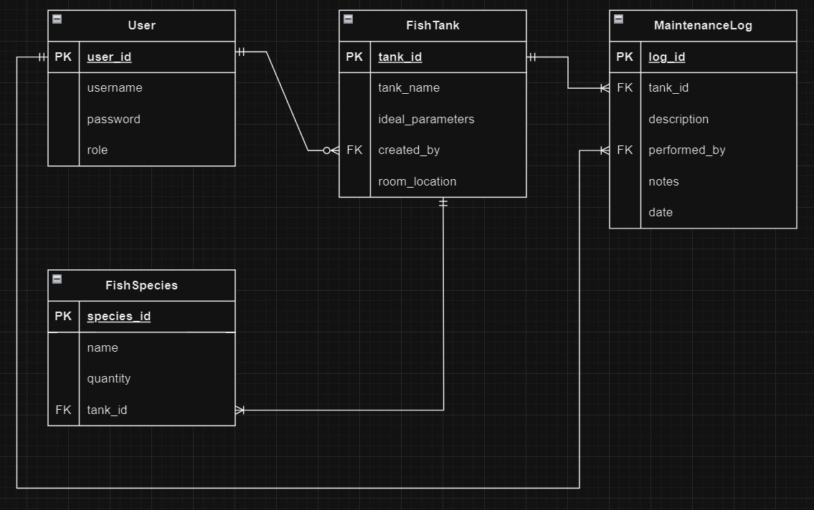


## R7 Explain the implemented models and their relationships, including how the relationships aid the database implementation.
#### This should focus on the database implementation AFTER coding has begun, eg. during the project development phase.

#### In this project, multiple models have been implemented to manage data related to fish species, tanks, users, and maintenance logs. The models and their relationships were carefully designed to ensure data integrity and efficient database operations during the projects development.

#### The models and relationships (Use above ERD image for reference):
1. User Model
- Attributes: id, username, password, is_admin
- Relationships:
    - One-to-Many with MaintenanceLog (a user can have multiple maintenance logs)
    - One-to-Many with Tank (a user can own multiple tanks)

2. Tank Model
- Attributes: tank_id, tank_name, user_id (FK)
- Relationships:
    - Many-to-One with User (each tank belongs to one user)
    - One-to-Many with FishSpecies (a tank can contain multiple fish species)
    - One-to-Many with MaintenanceLog (a tank can have multiple maintenance logs)

3. FishSpecies Model
- Attributes: species_id, species_name, quantity, tank_id (FK)
- Relationships:
    - Many-to-One with Tank (each species belongs to one tank)

4. MaintenanceLog Model
- Attributes: log_id, date, details, user_id (FK), tank_id (FK)
- Relationships:
    - Many-to-One with User (each log is performed by one user)
    - Many-to-One with Tank (each log is associated with one tank)


### The back_populates parameter in SQLAlchemy is used to define bi-directional relationships between the tables, ensuring that each side of the relationship knows about the other side. This helps in linking tables and their foreign keys (FKs) together, allowing for efficient data retrieval and manipulation. 

### Example from the project with the User and Tank models
models/user.py
```
class User(db.Model):
    __tablename__ = "users"
    id = db.Column(db.Integer, primary_key=True)
    username = db.Column(db.String, nullable=False, unique=True)
    password = db.Column(db.String, nullable=False)
    is_admin = db.Column(db.Boolean, default=False)

    tanks = db.relationship("Tank", back_populates="user")
    maintenance_logs = db.relationship("MaintenanceLog", back_populates="user")
```
models/fishtank.py
```
class Tank(db.Model):
    __tablename__ = "fishtank"
    tank_id = db.Column(db.Integer, primary_key=True)
    tank_name = db.Column(db.String, nullable=False)
    user_id = db.Column(db.Integer, db.ForeignKey('users.id'), nullable=False)

    user = db.relationship("User", back_populates="tanks")
    fish_species = db.relationship("FishSpecies", back_populates="tank")
    maintenance_logs = db.relationship("MaintenanceLog", back_populates="tank")
```

### Also used with the FishSpecies model and the Tank model (see above fish_species = db.relationship("FishSpecies", back_populates="tank"))

models/fish_species.py
```
class FishSpecies(db.Model):
    __tablename__ = "fishspecies"
    species_id = db.Column(db.Integer, primary_key=True)
    species_name = db.Column(db.String, nullable=False)
    quantity = db.Column(db.Integer, nullable=False, default=1)
    tank_id = db.Column(db.Integer, db.ForeignKey('fishtank.tank_id'), nullable=False)

    tank = db.relationship("Tank", back_populates="fish_species")
```


### Linking the Tables and Foreign Keys
#### Foreign Key Definition: In the Tank model, the user_id column is defined as a foreign key that references the id column in the User model:
```
user_id = db.Column(db.Integer, db.ForeignKey('users.id'), nullable=False)
```

### Bi-directional  (back_populates): The back_populates attribute is used in both models to define the relationship. In the User model, the tanks attribute indicates that a user can have multiple tanks. In the Tank model, the user attribute points back to the User model.
User model
```
tanks = db.relationship("Tank", back_populates="user")
```
Tank model
```
user = db.relationship("User", back_populates="tanks")
```
Using back_populates helps define clear, bi-directional relationships between the models, in which:
- Facilitates easier navigation and manipulation of the related data.
- Maintains data integrity and consistency.
- Simplifies complex queries by providing direct access to related objects.

This relational mapping aids in efficient database implementation and management, especially during the project development phase.


## R8 Explain how to use this application’s API endpoints. Each endpoint should be explained, including the following data for each endpoint:

- HTTP verb
- Path or route
- Any required body or header data
- Response
 
### API Endpoints:

- Authentication
    - POST Create or 'Register' a new user
    - POST Create or 'Login' a user
    - PUT/PATCH Update a user
    - Delete a user (admin only)

    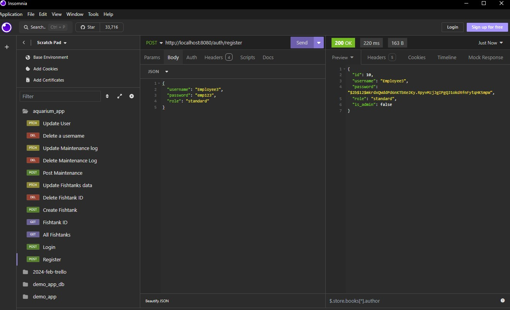

    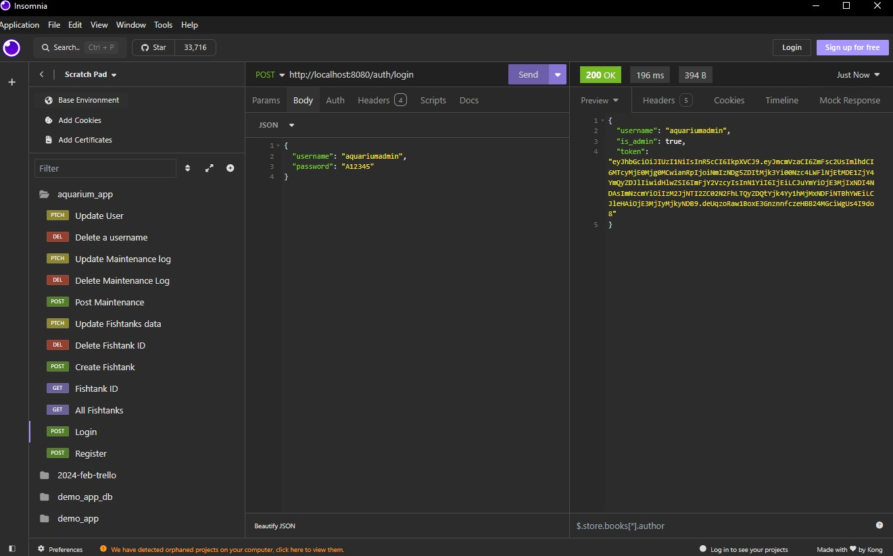

    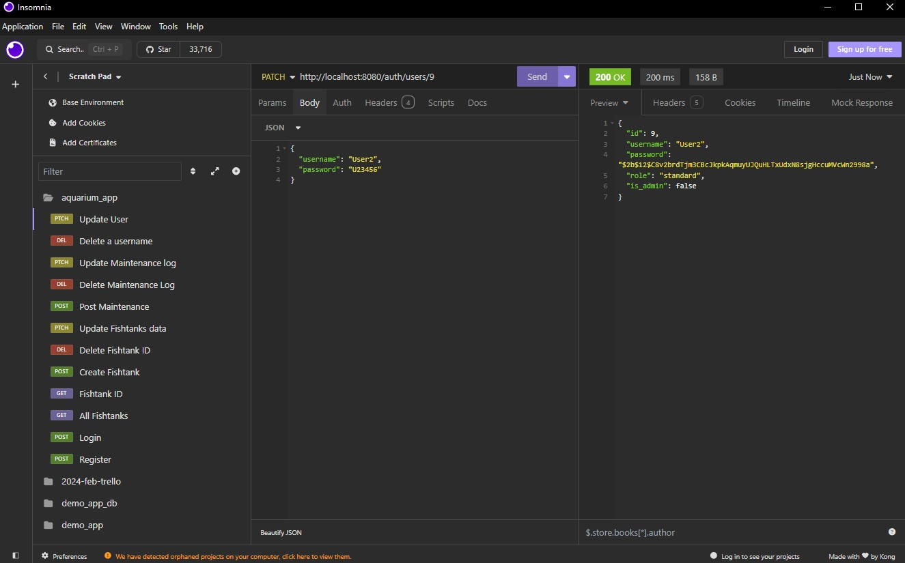

    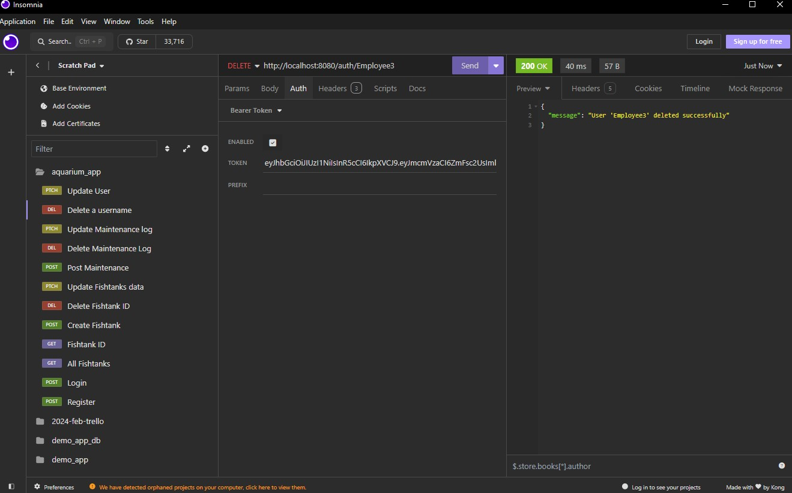


- Fishtank Endpoints:
    - GET read all fishtanks
    - GET read fishtank via id
    - POST create a new fishtank
    - PUT/PATCH update fishtank via id
    - DELETE fishtank via id (admin only)

    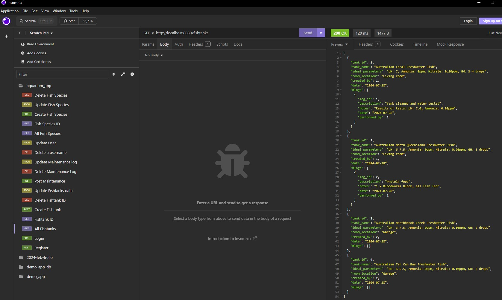

    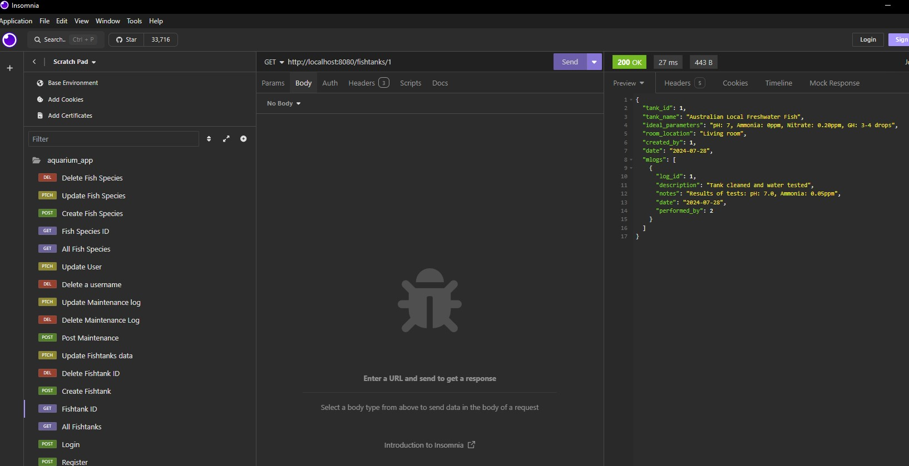

    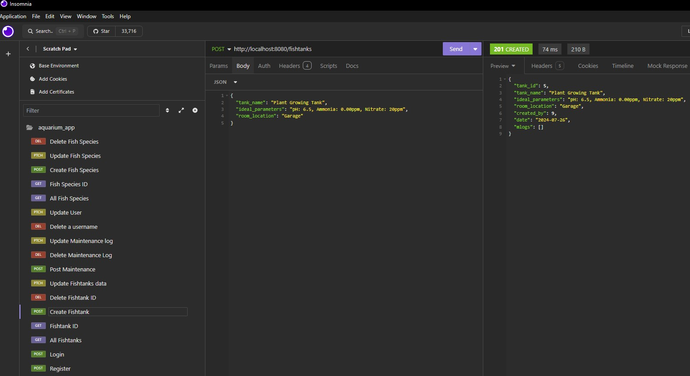

    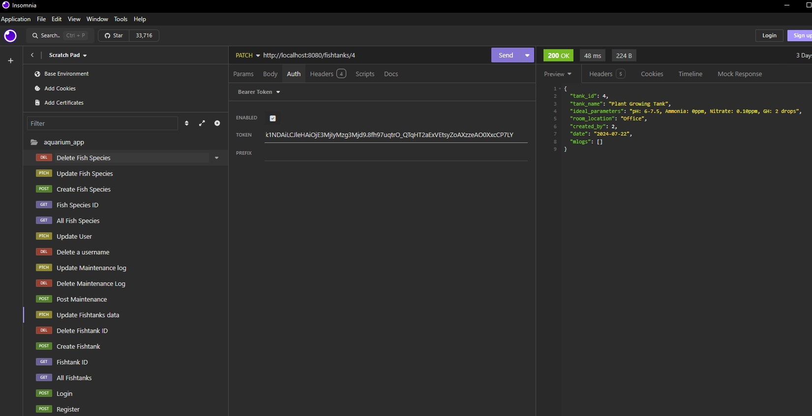

    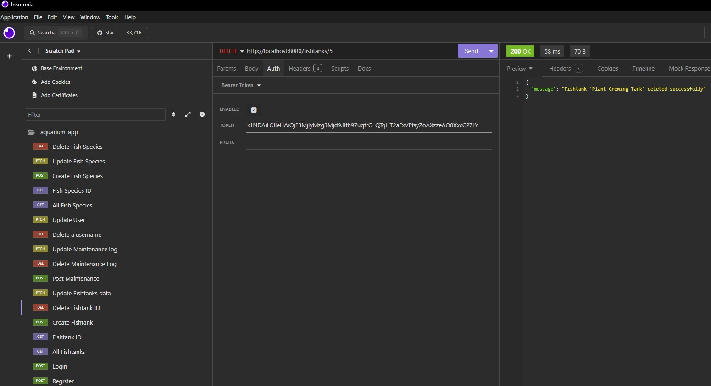


- FishSpecies Endpoints:
    - POST create fish species
    - GET read all fish species
    - GET read fish species via id
    - PUT/PATCH update fish species via id
    - DELETE fish species via id (admin only)

    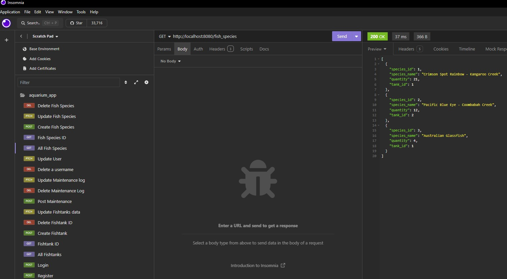

    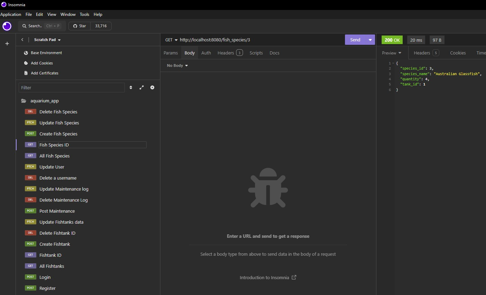

    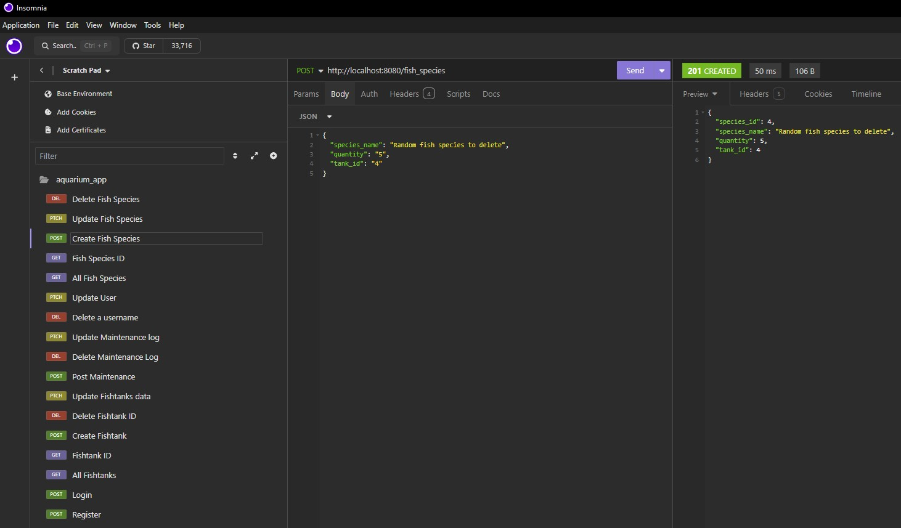

    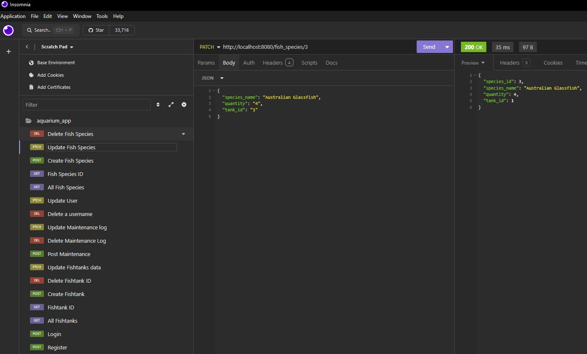

    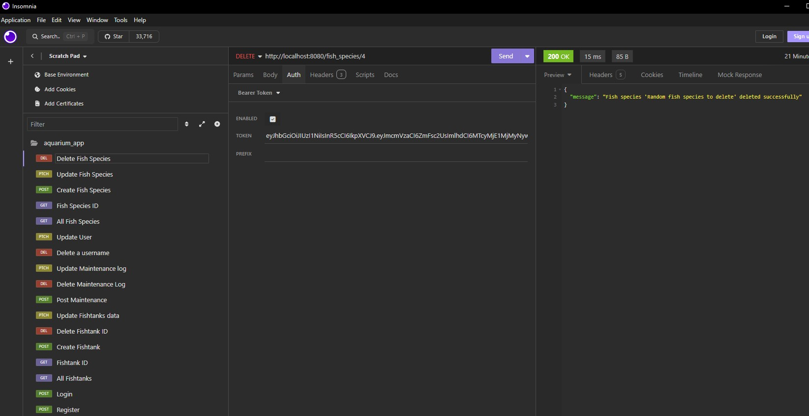


- MaintenanceLog Endpoints:
    - POST create a new maintenance log
    - PUT/PATCH update a maintenance log
    - DELETE maintenance log via id (admin only)

    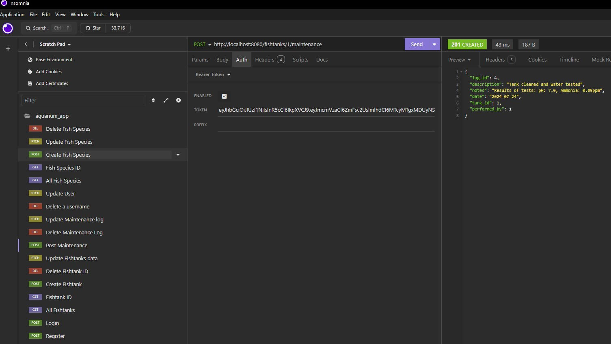

    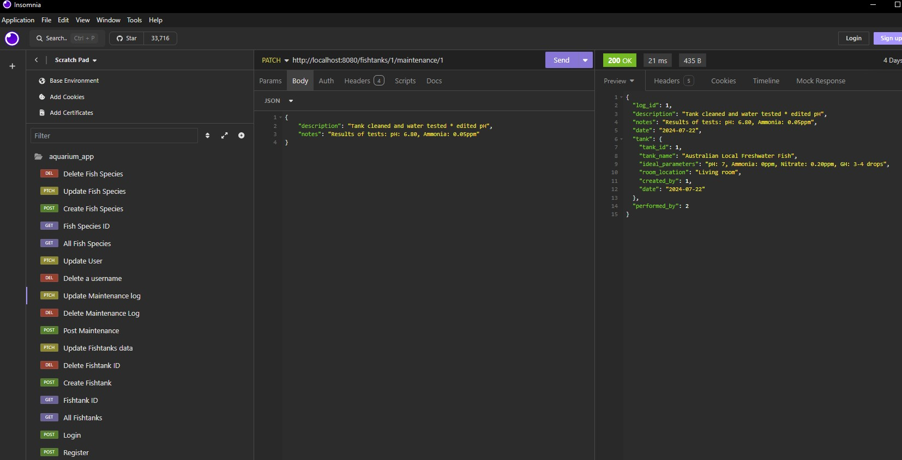

    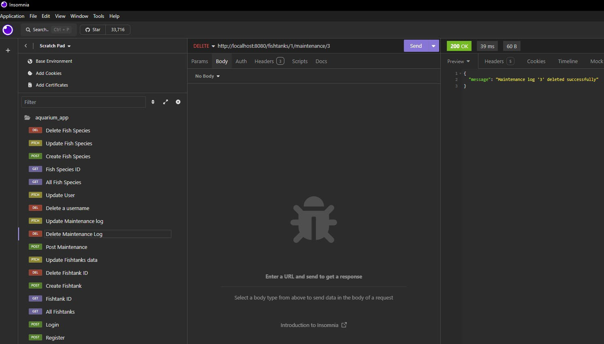
